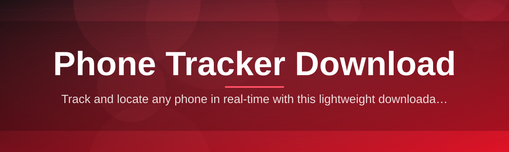
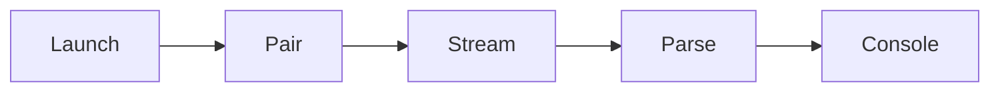

# phone-tracker-dc-console 📡🛰️

  

*A console-grade phone tracker download built for people who just need the location, not a lecture.*

  

---

## 🌱 Overview

It started as a weekend itch. I kept losing track of a work phone that bounced between three delivery drivers, and every "phone tracker download" I tried online was either a bloated subscription trap or a browser extension begging for permissions it had no business asking for. So I opened a terminal, wrote a console, and by Sunday night `phone-tracker-dc-console` was pinging coordinates back to a clean local dashboard. No account wall. No monthly toll booth.

This project is a lightweight, standalone Windows console for phone tracking and location download — built for solo devs, small delivery teams, IT admins managing company devices, and parents who want a no-drama way to check in on a family device. It leans into the terminal aesthetic on purpose: fast to launch, fast to read, fast to close. Under the hood it's a device-pairing session manager that turns raw GPS/network signal exchange into a readable, timestamped console feed you can actually act on.

Where this tool differs from the noise: it doesn't pretend to be a spy gadget, and it doesn't ask you to sideload anything sketchy onto a target device. It's a consent-based companion tracker — you pair devices you own or manage, and the console does the rest. If you've been burned by phone tracker download pages full of pop-ups, this is the anti-pop-up.

> [!NOTE]
> This tool is designed for tracking devices you own, manage, or have explicit permission to monitor — think fleet phones, family devices, or your own backup handset.

## 📥 Get the Build

  

---

## ⚡ Quick Start (before you read another word)

1. **Visit the landing page** using the download button above.

2. **Grab the latest Windows build** — it's a single portable executable, no bundled installer junk.

3. **Run it, pair a device, watch the console light up.** That's the whole ceremony.

> [!TIP]
> Pin the executable to your taskbar after the first run — most solo users end up opening this thing daily like a mini mission control.

Now for the part where I explain what's actually going on under the hood.

---

## 🧭 What This Console Actually Does

- **Instant device pairing** — scan a QR-style pairing code or enter a session key, and the console locks onto the target device in seconds. No SDK, no app store submission wait.

- **Live location console feed** — coordinates, speed, and heading stream into a scrolling terminal view instead of a laggy web map, so refresh rate feels immediate instead of "eventually."

- **Geofence alerts** — draw a boundary once, get a console alert the moment a device crosses it. Useful for delivery zones, curfews, or "why is the work phone at the beach."

- **Offline location cache** — when a device drops signal, the console keeps the last-known ping and timestamps the gap honestly instead of showing a stale dot pretending to be live.

- **Session history log** — every tracking session is written to a local log file, exportable as CSV, so you're never locked into the app to review past movement.

- **Multi-device roster** — track a handful of phones from one console window with tabbed sessions, ideal for small fleets or multi-kid households.

- **Battery + signal readout** — because "where is it" is only half the question; "will it survive the next hour" is the other half.

- **Zero telemetry by default** — the console doesn't phone home about your phone tracker download habits. What you track stays on your machine.

<b>🔍 Curious about the pairing flow specifically?</b>

 

Pairing uses a short-lived session token generated on the target device's companion screen. You enter that token into the console, a handshake confirms both ends agree to share location, and from that point forward the console polls at your configured interval. Tokens expire fast on purpose — no permanent silent access, ever.

---

## 🖥️ System Requirements

| Requirement | Details |
|---|---|
| OS | Windows 10 or Windows 11 (64-bit) |
| Install method | Standalone `.exe` — no installer, no dependency chain |
| Disk space | Under 80 MB |
| RAM | 2 GB minimum, 4 GB comfortable |
| Network | Internet connection for live pairing sessions |
| Runtime | None required — everything is self-contained |

> [!IMPORTANT]
> This is a standalone console. There is no hidden background service installer, no scheduled task silently added to your system — what you download and run is what's running.

---

## ⚙️ How It Works

The architecture is intentionally boring in the best way — fewer moving parts means fewer things to break at 2am.

1. **Launch** the console executable on your Windows machine.

2. **Generate or enter a pairing session** to establish a trusted link with the target device.

3. **Location data streams in** over the paired session, arriving as structured console events.

4. **The console parses and renders** each event — coordinates, speed, geofence status — in real time.

5. **Everything logs locally**, so history survives even after you close the window.

---

## 🩹 Troubleshooting

**Q: The console launches but pairing never completes — what gives?**
A: Session tokens expire quickly (usually under 3 minutes). Regenerate a fresh token on the target device and re-enter it without delay.

**Q: My download shows as blocked by SmartScreen.**
A: This happens with new, unsigned indie builds. Click "More info" then "Run anyway" — the binary is unmodified from the landing page release.

**Q: Location updates feel delayed by several minutes.**
A: Check the polling interval in Settings. The default balances battery life on the tracked device against freshness — lower it if you need near-live updates.

**Q: Can I track a device that's powered off?**
A: No — and no phone tracker download tool honestly can. You'll see the last-known ping with an "offline since" timestamp instead.

**Q: The console window looks blank after launch.**
A: Resize the window once — some Windows terminal profiles render the ANSI console UI incorrectly until the first resize event fires.

**Q: Where does exported CSV history save to?**
A: Locally in the app's data folder by default; you can change the export path in Settings → Storage.

---

## 🎨 Console UI & UX Details

The whole interface lives in a keyboard-first terminal shell — mouse optional.

- **Themes:** Dark (default), Light, and a high-contrast "Amber CRT" mode for late-night monitoring sessions.

- **Keyboard shortcuts:**
  - `Ctrl+P` — open pairing dialog
  - `Ctrl+G` — toggle geofence overlay
  - `Ctrl+E` — export session log
  - `Tab` — cycle between paired devices
  - `Esc` — collapse current session panel

- **Settings panel** covers polling interval, geofence radius units (meters/feet), notification sound toggle, and log retention length.

> [!TIP]
> Amber CRT theme plus a 30-second polling interval is the combo most fleet-tracking users settle on — easy on the eyes during long shifts.

  

---

## 🤝 Contributing & Community

This started as one dev's Sunday project and it stays maintained the same way — issues get read, PRs get reviewed, no corporate approval chain in between.

- Open an issue for bugs, oddities, or "why does the console do this" questions.
- Fork it and send a pull request if you've fixed something or added a feature that fits the console-first philosophy.
- Feature requests are welcome, especially ones that keep the tool lightweight rather than bloated.

> [!WARNING]
> Contributions that add telemetry, ad SDKs, or forced account creation will be closed without much discussion. This project's whole identity is "it just works, quietly."

---

## 📜 License

Released under the [MIT License](LICENSE), 2026. Use it, fork it, ship it in your own toolkit — just keep the attribution intact.

---

## ⚠️ Disclaimer

`phone-tracker-dc-console` is built for tracking devices you own or have explicit authorization to monitor — company-issued phones, family devices with consent, or your own hardware. It is not designed or intended for covert surveillance of individuals without their knowledge. Location tracking laws vary by region and device ownership context; you are responsible for using this tool in compliance with applicable laws where you live and operate. The maintainers assume no liability for misuse.

---

  

